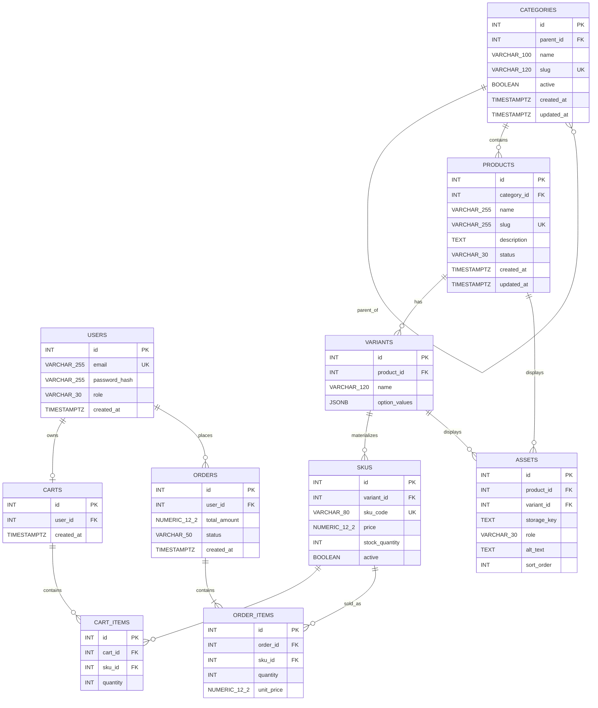

# Sprint 2: Catalog Data Foundation
## Clothes & Apparel Retail

## 1. Sprint goal and scope boundary

Sprint 1 defines a Direct-to-Consumer clothes and apparel retail system whose major catalog problem is confusing taxonomy/sizing and inventory accuracy. Sprint 1 selected React.js, Node.js/Express, PostgreSQL, and Redis. Sprint 2 reuses that stack and implements the relational catalog foundation.

Sprint 2 includes:
- category tree management
- product creation/editing
- variants and SKUs
- price and stock constraints
- protected administrative operations
- migrations, seed data, and automated tests

Sprint 2 does not claim public catalog search, dynamic specifications, asset upload, publication workflows, payment, order placement, shipping, or complete checkout. Those remain Sprint 3 or later.

## 2. Sprint 1 decisions reused

The Sprint 1 business scenario is **Clothes & Apparel Retail**. The original MVP includes Catalog, Cart, Checkout, Authentication and Admin Inventory Control. The Sprint 2 catalog is designed so later Cart, Order and Checkout work can reference SKU identities rather than duplicate product/price logic.

The Sprint 1 ERD already connects Categories -> Products and Products -> Cart Items / Order Items. Sprint 2 preserves these relationships and adds Variants and SKUs.

## 3. Updated ERD and data dictionary



### Data dictionary

| Entity | Key fields | Meaning |
|---|---|---|
| Category | id, parent_id, name, slug, active | Hierarchical apparel taxonomy |
| Product | id, category_id, name, slug, description, status | Customer-facing product identity |
| Variant | id, product_id, option_values | Valid product option combination such as color/size |
| SKU | id, variant_id, sku_code, price, stock_quantity, active | Sellable inventory identity |
| Asset | id, product_id/variant_id, storage_key, role | Future product/variant media |
| Cart | id, user_id | Sprint 1 persistent cart connection |
| Cart Item | id, cart_id, sku_id, quantity | Future selected SKU |
| Order | id, user_id, total_amount, status | Sprint 1 order connection |
| Order Item | id, order_id, sku_id, quantity, unit_price | Immutable sold SKU reference |

Money uses PostgreSQL `NUMERIC(12,2)`, not floating point. Stock uses `INT CHECK (stock_quantity >= 0)`.

### Foreign-key policies

- Category parent: `ON UPDATE CASCADE`, `ON DELETE RESTRICT`
- Product -> Category: `ON UPDATE CASCADE`, `ON DELETE RESTRICT`
- Variant -> Product: `ON UPDATE CASCADE`, `ON DELETE CASCADE`
- SKU -> Variant: `ON UPDATE CASCADE`, `ON DELETE CASCADE`
- Cart -> User: `ON DELETE RESTRICT`
- Cart Item -> SKU: `ON DELETE RESTRICT`
- Order Item -> SKU: `ON DELETE RESTRICT`

Historical cart/order records therefore keep stable SKU identities.

## 4. Administration route table

All `/api/v1/admin/*` routes require `Authorization: Bearer <JWT>` and an authenticated user with role `admin`.

| Method | Route | Purpose | Success |
|---|---|---|---|
| POST | `/api/v1/auth/login` | Obtain admin JWT | 200 |
| POST | `/api/v1/admin/categories` | Create category | 201 |
| GET | `/api/v1/admin/categories` | List category tree | 200 |
| PATCH | `/api/v1/admin/categories/:id` | Edit/deactivate category | 200 |
| DELETE | `/api/v1/admin/categories/:id` | Soft-deactivate category | 200 |
| POST | `/api/v1/admin/products` | Create draft/product | 201 |
| GET | `/api/v1/admin/products` | List admin products with variants/SKUs | 200 |
| PATCH | `/api/v1/admin/products/:id` | Edit product/status | 200 |
| POST | `/api/v1/admin/products/:id/variants` | Add variant | 201 |
| POST | `/api/v1/admin/products/:id/skus` | Add SKU | 201 |
| PATCH | `/api/v1/admin/skus/:id` | Update price/stock/active | 200 |

Duplicate category/product slugs and duplicate SKU codes return `400` with a clear JSON error. Unauthenticated requests return `401`; authenticated non-admin requests return `403`.

### Example login

```http
POST /api/v1/auth/login
Content-Type: application/json

{
  "email": "admin@example.com",
  "password": "Admin@12345"
}
```

Response:

```json
{
  "token": "<redacted>"
}
```

### Example category creation

```http
POST /api/v1/admin/categories
Authorization: Bearer <redacted>
Content-Type: application/json

{
  "name": "Men Shirts",
  "slug": "men-shirts",
  "parent_id": 2
}
```

### Example product creation

```http
POST /api/v1/admin/products
Authorization: Bearer <redacted>
Content-Type: application/json

{
  "name": "Classic Cotton Shirt",
  "slug": "classic-cotton-shirt",
  "description": "Breathable everyday cotton shirt",
  "status": "draft",
  "category_id": 4
}
```

### Example variant

```http
POST /api/v1/admin/products/1/variants
Authorization: Bearer <redacted>
Content-Type: application/json

{
  "name": "White / M",
  "option_values": {
    "color": "White",
    "size": "M"
  }
}
```

### Example SKU

```http
POST /api/v1/admin/products/1/skus
Authorization: Bearer <redacted>
Content-Type: application/json

{
  "variant_id": 1,
  "sku_code": "SHIRT-WHT-M",
  "price": 2499.00,
  "stock_quantity": 20,
  "active": true
}
```

## 5. Data integrity and authorization decisions

### Business rule 1: Draft vs published/sellable products
A draft product may have zero SKUs because product identity can be prepared before inventory is ready. In this implementation, the `active` product status is administrative catalog status; before Sprint 3 publication rules are introduced, the system does not claim a public publishing workflow. A future public API should require at least one active, in-stock SKU before presenting a product as sellable.

### Business rule 2: Category assignment
A product has one canonical category through `products.category_id`. This preserves the Sprint 1 1:N Category -> Product model and avoids introducing many-to-many taxonomy complexity in Sprint 2.

### Business rule 3: Deactivated parent category
Deactivation is a soft operation (`active=false`). Child records remain intact. New products cannot be assigned to an inactive category. This avoids destructive loss of catalog relationships.

### Business rule 4: Out-of-stock SKU
An SKU with `stock_quantity=0` is retained as an inventory record but is not sellable when `active=false`. Sprint 3 public responses should expose availability as false rather than inventing a new SKU.

### Business rule 5: Shared prices and overrides
Two SKUs may have the same price. Each SKU stores its own price, allowing a future SKU-level price override without changing product identity.

### Business rule 6: Negative stock and duplicate SKU codes
PostgreSQL enforces `CHECK (stock_quantity >= 0)`. PostgreSQL also enforces `UNIQUE(sku_code)`. API validation provides early client feedback, but database constraints remain the final integrity layer.

### Business rule 7: Products used by future carts/orders
Products are deactivated instead of physically deleted. Orders and cart items reference SKUs with restrictive foreign keys, preserving historical identity.

### Variant combination rule
Only actual combinations are represented. For example, if a shirt has White/Medium, White/Large and Black/Medium, the missing Black/Large combination is not inserted as a fake zero-stock SKU.

## 6. Seed data and demonstration

Run:

```bash
npm install
npm run migrate
npm run seed
```

Seed data contains:
- a two-level category tree
- at least three products
- a product with multiple variants
- four SKU records
- one unavailable SKU combination/record
- an administrator account

Demonstration flow:
1. Login as admin.
2. Create a category.
3. Create a product under the category.
4. Create a variant with size/color options.
5. Create a SKU with price and stock.
6. Retrieve `/api/v1/admin/products`.
7. Retrieve `/api/v1/admin/categories`.

Tokens must be redacted in submitted screenshots.

## 7. Test strategy, command, and result

Automated tests cover:
- required product/SKU fields
- non-negative stock
- non-negative price
- unique SKU constraint design
- category cycle prevention
- administrative authorization requirement

Run:

```bash
npm test
```

The migration also contains database-level uniqueness, foreign-key and check constraints. The Express layer handles client-facing validation errors.

## 8. Known limitations and Sprint 3 backlog

Sprint 2 deliberately does not implement:
- public catalog search/filtering
- dynamic specification validation
- asset upload/storage integration
- public publication workflow
- payment processing
- order placement
- shipping
- complete shopper checkout

Sprint 3 should consume these catalog tables and SKU identities. Its first backlog items are dynamic specifications, assets, public catalog reads, publication rules, and catalog-to-cart readiness.
